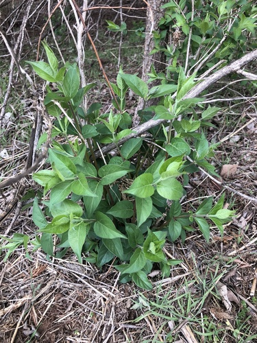
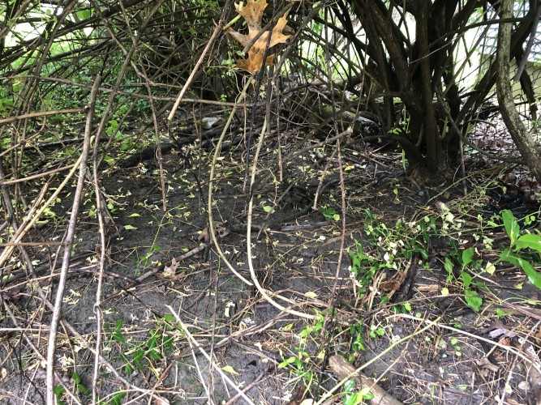

# Invasive Plant Removal

<h2>On Indianapolis Residential Property</h2>

Irvington Garden Club

January 27, 2025

By Joseph D. Purcell

[Link to slides](https://josephdpurcell.github.io/how-to-remove-invasive-plants/presentations/2025-01-27-IGC/index.html)

## About Me <!-- omit in toc -->

I am a hobbyist, not an expert.

Note: I work at Five9 as a Software Engineer

## Assumptions <!-- omit in toc -->

- You are wanting to develop skills for removing invasive plants and are a beginner
- You know the importance of getting rid of invasive plants (impact on parks and ecosystem)
- You take ownership over your space(s) and want to do better

## Overview <!-- omit in toc -->

<!--
You can use VSCode Markdown All In One to generate TOC:
    "markdown.extension.toc.levels": "2..3",
    "markdown.extension.toc.plaintext": true
-->

- Terminology
  - Native vs Non-Native
  - Net-negative Benefit
  - Managed vs Unmanaged
  - Invasive vs Non-Invasive
- Skills
  1.  Bio Material Handling
  2.  Displacement
  3.  Exhaustion
  4.  Identification
  5.  Legal Understanding
  6.  Perseverance
  7.  Planning
  8.  Poison
  9.  Removal
  10. Wilding
- Non-Native Naughty List
  1. Amur Honeysuckle
  2. Fortune's Spindle
  3. Sweet Autumn Clematis
  4. White Mulberry
  5. Tree of Heaven
- Start Today

Note: Invasive plants have net-negative benefit for the native ecosystem, there are 10 skills to combat them with, and today you can get the Seek app to identify them,

## Terminology

### Native vs Non-Native

Native species are indigenous to the ecosystem.

(eg. Trumpet Vine, Poison Ivy)

Non-native species are not indigenous.

(eg. Amur Honeysuckle, Dandelion)

Resources: [BONAP](http://www.bonap.org/), [USDA](https://plants.usda.gov/), [ITIS](https://www.itis.gov/)

> Native status is difficult to define and is somewhat arbitrary (USDA)

Note: has legal definitions but doesn't seem to relate to anything enforceable?

### Net-negative Benefit

- Offers little or no food supply (for native life)
- Crowds out native plants (which do offer food)
- Changes structure and content of soil (causes erosion, suppression of native growth)

Note: Example, my childhood forrest is now Vinca. Its beauty doesn't outweigh the cost of having no more berries or mushrooms.

### Managed vs Unmanaged

A managed area requires human upkeep.

An unmanaged area requires little or no human involvement (eg. a day a year to audit).

Note: my childhood forrest is unmanaged, but the home and farm nearby where the Vinca came from is managed.

### Invasive vs Non-Invasive

Invasive species result in net-negative benefit for an ecosystem. (eg. Fortune's Spindle)

Non-invasive species are neutral or positive. (eg. Tomatoes)

Resources: [IISC](https://ag.purdue.edu/department/entm/iisc/), [GISD](https://www.iucngisd.org/gisd/), [NISIC](https://www.invasivespeciesinfo.gov/terrestrial/plants), [NatureServe](https://explorer.natureserve.org/)

### Perspective Matters <!-- omit in toc -->

Trumpet Vine is legally a non-invasive native in Indiana ([USDA](https://plants.usda.gov/plant-profile/CARA2), [Natureserve](https://explorer.natureserve.org/Taxon/ELEMENT_GLOBAL.2.148989/Campsis_radicans))...

- In practice some call it invasive because it invades managed areas (eg. [gardens](https://www.purdue.edu/hla/sites/yardandgarden/trumpet-creeper-is-no-shrinking-violet/))
- But, it's ecological benefits are well known: hummingbirds, pollinators, ants, etc ([link](https://illinoiswildflowers.info/trees/plants/trumpet_creeper.htm))

Poison Ivy is legally a non-invasive native...

Differences between legal and common understandings requires deep dive into [Federal and State](https://www.invasivespeciesinfo.gov/subject/lists) regulations.

## Skills

Skills are how you get rid of invasive plants.

- What is it
- When to use it
- How to apply it

### 1. Bio Material Handling

Handle bio material safely and with control.

Use when interacting with plants (Exhaustion, Poison, Removal)

#### Protective Clothing

You will encounter toxins, thorns, and burrs.

(eg. myocarditis from Tree of Heaven sap entering bloodstream via open blisters)

Clothing to consider:

- Thick leather gloves (single most important!)
- Long sleeves and long pants with very tight weave (eg. polyester running clothes)
- Hat
- Sturdy shoes (eg. leather boots)

#### Bagging

If the plant has gone to seed or fruit make sure you bag it immediately on site using non-porous bag (eg. plastic).

Treat it as a hazardous material.

Don't leave it in the bag to mold.

Take to a composting center, landfill dropoff, or make biochar.

#### Biochar

You can't leave plants to decompose without propagation risk.

Burning them into biochar terminates them, is carbon neutral ([link](https://sustainability.stackexchange.com/questions/7009/is-burning-wood-the-same-as-letting-it-biodegrade-from-a-co2-emissions-perspecti)), and is a soil encrichment ([USDA](https://www.climatehubs.usda.gov/hubs/northwest/topic/biochar), [Terra preta](https://en.wikipedia.org/wiki/Terra_preta)).

- Option 1: Burn barrel with dolly so you can burn on site. See online videos for strategy and safety considerations.
- Option 2: Trench burn is good at handling large quantities. Requires higher degree of safety with less quality biochar.

### 2. Displacement

Prevent invasive plants from occupying a space.

Use when there is vacant space (Exhaustion, Removal)

#### Methods

1. Convert to barren areas, eg. rocks, parking lots, buildings.
2. Convert to native areas, see also "Wilding".

### 3. Exhaustion

Reduce a plant's energy stores, reproductive means, access to food, or energy production through mechanical means.

Use when Removal isn't viable

#### Removal of Sources

Plants don't respect fences. Invasive plants are great at propagating from elsewhere.

Talk to your neighbors, invite them to the [Irvington Burn Fest](https://www.irvburnfest.com/) on October 5, 2025.

#### Smothering

Cut off energy production (photosynthesis) by covering.

First, mow it to the bare ground. Then, add a covering:

- Plastic: UV stabilized plastic, 1000 gauge or 6 mil (~0.15-0.25 mm), remove after a year
- Bio materials: let the cover decompose over years; cut holes and plant plugs; material options:
  - Cardboard: avoid toxic ink and remove tape; secure to ground with sticks
  - Mulch: 2-4" thick
  - Dirt: >4" thick?

Note: newspaper, dirt, solarization (clear plastic to heat), propane torch

#### Cutting

Range from precision (loppers, clippers, snips) to annihilation (mowing, weed eating).

For plants that don't seed or fruit in their first year (eg. White Mulberry) you can precision cut once after spring growth and again in fall before winter. Repeat annually.

Note: I do precision cutting with White Mulberry, Japanese Knotweed, vines that climb (English Ivy, Fortune's Spindle), Creeping Thistle.

### 4. Identification

Sufficiently determine a plant is invasive.

Use when you interact with any plant

Note: Only need to sufficiently identify, doesn't have to be species.

#### Observe

Look around. Invasive plants are obvious. (All around Irvington Circle, Pennsy Trail, yards).

- Does it turn green before anything else and stay green longer?
- Do birds know how to nest in it or eat its fruit/seed? (Question of nutritional content)
- How many bugs are there on it versus native plants?
- How quickly does it grow?

Note: See how invasives productivity compares to the best, goldenrod, aster, black raspberry, pokeberry

#### Seek App

Open the app and point. (Apple and Android)

Indicates if native or endangered and gives photos to compare.

Limitations! Some species it doesn't get and sometimes it gets a bad photo.

#### iNaturalist

Online forum where experts will help classify your plants.

Requires higher level of skill and more datapoints.

Contributes to research!

#### Purdue Plant and Pest Diagnostics Lab (PPDL)

[PPDL](https://ag.purdue.edu/department/btny/ppdl/) can identify by:

- Photo samples (similar format as iNaturalist)
- Physical samples (DNA test)

### 5. Legal Understanding (NOT ADVICE)

Understand the legal constraints of invasive plant removal.

Use when you are Bio Material Handling, Poison, or Wilding

#### Vegetation Height: BNS

[Indianapolis Code of Ordinances Section 575-2](https://library.municode.com/in/indianapolis_-_marion_county/codes/code_of_ordinances?nodeId=TITIIIPUHEWE_CH575ENPUNU_ARTIINGE_S575-2DE) mandates vegetation be lower than 12" and is enforced by the Bureau of Neighborhood Services (BNS).

- Whistleblower service May 1 to Oct 31
- City can enter your property to mow and bill you (min. $383)
- Civil enforcement up to $2,500 per day plus court costs
- Dismissal of a violation does not abate future violations
- Failure to pay can become a lien

#### Vegetation Height: BNS

Exemptions:

1. Farming, gardening, horticulture (1)
2. The native area is 150' from an occupied building and health department says it's OK (4)
3. Registered rain garden (6)
4. Registered native planting area (7)

#### Vegetation Height: Health Department

Health Department's [Health and Hospital Code Sec. 10-301, 10-302, 10-303](https://marionhealth.org/resources/) is general "cut and dispose of high weeds and grass" to avoid conditions in which "rodents, mosquitoes, or vectors have food, shelter, or a breeding place".

- No exemptions
- Penalty up to $250 and/or enforcement case up to $2,500 per violation per day
- Health Dept. can enter your property to "correct" and bill you
- Failure to pay can become a lien

#### Disposal in Trash

- Vegetative matter produces methane in anaerobic environments, so trash is not a good option.
  - However, [Indiana Code 13-20-9](https://iga.in.gov/laws/2024/ic/titles/13#13-20-9) allows house plants, grass, or bundled/bagged woody vegetative matter less <3', but not leaves.
  - Municipalities can establish their own ordinances, I couldn't find one for Marion County.
  - Illegal dumping can be a fine up to $2,500.
  - Indy's South Side Landfill captures methane.
- Dropoff with fee at the [Citizen's Transfer station](https://www.indy.gov/activity/citizens-transfer-station)  (Assume it goes to landfill?)

#### Disposal via Composting

Compost at home. However, risk of propagation and may be a Health Department violation.

Dropoff at a [composting facility listed by IDEM](https://www.in.gov/idem/waste/waste-industries/yard-waste-and-composting-facilities/).

Note: My piles of sticks and said they need to be in a compost bin. I made 4' diameter circles using 4' tall chicken wire.

#### Disposal via Burning

IDEM allows but advises against open burning citing harm to human health and environment ([link](https://www.in.gov/idem/waste/waste-industries/yard-waste-and-composting-facilities/), [link](https://www.in.gov/idem/openburning/health-risks-and-environmental-impacts/)).

[Indianapolis Code of Ordinances Section 511-703](https://library.municode.com/in/indianapolis_-_marion_county/codes/code_of_ordinances?nodeId=TITIIIPUHEWE_CH511AIPOCO_ARTVIIGEPR_S511-703LIBUSPPU) allows burning dried limbs, twigs, and branches (but not leaves): originating from the property, between 10 am and 3 pm, 15 ft. distance, sufficiently vented with mesh covering max 0.25", and always attended with means to extinguish.

See also [indy.gov](https://www.indy.gov/activity/open-burning) and [in.gov](https://www.in.gov/dhs/get-prepared/fire-safety/open-burning/) for info and tips, eg. avoid during [Air Quality Action Days](https://www.in.gov/idem/airquality/air-quality-action-day-aqad-advisories/) or [burn bans](https://www.in.gov/dhs/burn-ban-map/).

Potential liability or fines if fire causes damages or is unsafe.

#### Poison

Regulation of Herbicide (Pesticide) use at Federal is [EPA](https://www.epa.gov/pesticides) and State is [Office of Indiana State Chemist (OISC)](https://oisc.purdue.edu/pesticide/) and Indiana DNR. See [OISC Laws and Rules](https://oisc.purdue.edu/pesticide/laws_regs.html).

[Marion County Health Department (MCHD)](https://marionhealth.org/hazardous-materials-program/), [OISC](https://oisc.purdue.edu/pesticide/pesticide_complaint_investigations.html), and [IDEM](https://www.in.gov/idem/contact/file-a-complaint/) all handle complaints.

[MCHD](https://marionhealth.org/hazardous-materials-program/) and [IDEM](https://www.in.gov/idem/cleanups/investigation-and-cleanup-programs/emergency-response/) handle spills and emergency response. [Poison Control](https://www.poison.org/) (1-800-222-1222) can also help.

#### Sale

Since 2020 the [Indiana Terrestrial Plant Rule (312 IAC 18-3-25)](https://iar.iga.in.gov/code/2026/312/18#312-18-3-25) makes it illegal to "sell, offer or grow for sale, gift, barter, exchange, or distribute" only the 44 plants listed.

[INPS notes](https://indiananativeplants.org/invasive-plants/) nurseries still sell commonly considered invasive species. Dammann's may not sell but at least promotes:

- "Beautiful, showy [Sweet Autumn] clematis are not as difficult to grow as you might think" ([Accessed Jan 20, 2025](https://dammanns.com/2022/08/30/clematis/))
- "English Ivy makes a fine choice for the outdoor landscape" ([Accessed Jan 20, 2025](http://plants.dammannsgardenco.com/12130021/Plant/201/English_Ivy/))
- "Concorde Japanese Barberry makes a fine choice for the outdoor landscape", hybrid cultivar of illegal Japanese Barberry ([Accessed Jan 20, 2025](http://plants.dammannsgardenco.com/12130021/Plant/3229/Concorde_Japanese_Barberry/))
- Plant library is < 5% native ([link](dammanns-plant-name-analysis-2025-01-27.md))

Note: how many of these will end up on the invasive list?

#### Ownership

No restrictions on owning invasive plants. [Indiana Terrestrial Plant Rule (312 IAC 18-3-25)](https://iar.iga.in.gov/code/2026/312/18#312-18-3-25) notes you can report to IDNR, eg. via [EDDMapS](https://www.in.gov/dnr/rules-and-regulations/invasive-species/terrestrial-invasive-species-plants/).

The one exception is Tree of Heaven. [Indianapolis Code of Ordinances Section 391-112](https://library.municode.com/in/indianapolis_-_marion_county/codes/code_of_ordinances/358893?nodeId=TITIIPUORSA_CH391NU_ARTIINGE_S391-112AITRTRHEDENU) says it is public nuisance and you must "remove it upon notice by the city to do so", which can be enforced with fines. City is expected to remove them on city-owned land, call [Mayor's Action Center](https://www.indy.gov/agency/mayors-action-center) 317-327-4622 to report.

Note: Can you report Tree of Heaven to the city? What about all those by Butler and E Market?

### 6. Perseverance

Continue removal efforts despite adversity or inability to envision success.

Use when you put forth any substantial effort

#### Tips on Persevering

- Think in geological time. You may not see results in your lifetime.
- 1 square foot at a time, 1 year at a time.
- Remember first principles: do it because it's right, not because it's easy or for results.
- You aren't alone, don't do it alone. Invasive removal is a communal effort.

Note: someone named Liz overheard me and went on a rant about how hard it is to promote native plants

### 7. Planning

Optimize effort to maximize ecological benefit.

Use when you have more work than time

#### Divide and Conquer

Note: barren=driveway,house,garage; check unmanaged annually; unmanaged invasive contained would be Fortune's Spindle; avoid bottom left

### 8. Poison

Reduce a plant's energy stores, reproductive means, access to food, or energy production through chemical means.

Use when drastic measures are required

(Cancer analogy: destructive means for greater good.)

#### Herbicide Guidance

CAUTION! Poison is poison, handle accordingly!

[MCSWD](https://www.hamiltonswcd.org/news-articles/herbicideapplicationseries1), [DNR](https://www.in.gov/dnr/forestry/grants-and-help/forestry-best-management-practices/forestry-best-management-practices/forestry-bmp-non-logging-bmps/planting-and-weed-control/), [IDEM](https://www.in.gov/idem/health/common-environmental-health-threats/pests-and-pesticides/), [MCHD](https://marionhealth.org/programs/environmental-health/water-quality-and-hazardous-materials-management/hazardous-materials/) all have warnings and safety tips about herbicide.

State of Indiana Cooperative Invasives Management (SICIM) has an herbicide calendar for most effective treatment and other resources ([link](https://www.sicim.info/control-and-management)).

#### Triclopyr

- Put on plastic gloves
- Fill dauber bottle
- Cut plant or bend to expose stem
- Daub a few times until stem cut is saturated
- Do NOT touch your skin!
- Apply when it is not going to rain for 24 hrs

Note: Used by Dept. of Land Stewardship. Alt method is squirt bottle.

#### White Vinegar and Salt

I've experimented with 50% White Vinegar (the regular 5% stuff) and 50% rock salt dissolved in water. Seems to kill growth of that stem, but not entire plant.

### 9. Removal

Remove a plant from an area through mechanical means.

Use when you have strength, soil is wet, and have Bio Material Handling

Note: don't hurt yourself!

#### Plants <2'

Tend to do fine pulling by hand:

- Key is to get all of the root! Yank at the base, if it snaps dig up the root
- Delicate plants like Creeping Thistle and Japanese Knotweed can sometimes be pulled by hand when the soil is very wet without much fuss.
- Sometimes I first loosen with a quick trowel jab.
- For strong roots like Amur Honeysuckle saplings you can yank away.

#### Plants 2-4'

Requires strategy:

- Usually trunk is less than 1" and the root system can be cut with vigorous shoveling
- Jab shovel every few inches about 4" away from center
- Pry with shovel while pulling vigorously
- Easier when soil is wet.

#### Plants >4'

Requires more strategy:

- First, cut the canopy down to the ground (eg. loppers).
- Shovel jab 1' around stump to cut roots. If shovel can't cut, dig to expose roots and use loppers.
- Pry up with bar.

Tips:

- Wait for wet soil, see [GreenCast soil moisture map](https://www.greencastonline.com/tools/soil-moisture)
- Be careful! Know when its too big.
- Regular stretching and exercise can boost your skill.

#### Vines

- Sweet Autumn Clematis you can role each strand into a ball, find root ball, and dig about 12" down to get root ball
- English Ivy and Fortune's Spindle are impossible, there isn't a root ball; use another method like Exhaustion

#### GIST Handbook and Tools

Global Invasive Species Team (GIST) [Weed Control Methods Handbook](https://www.invasive.org/gist/handbook.html) and [tool reviews](https://www.invasive.org/gist/tools.html) have a lot of tips and ideas.

Note: I've theorized about some of those tools

### 10. Wilding

Prevent invasive plants from occupying a space through biotic resistance.

Use when you want to minimize effort and maximize ecological benefit

#### Avoid Disturbances

- Key is to make a space where invasives can't get a foothold
- Disturbing areas give invasives a foothold
  - Notice they congregate around fences and highways?
- Remove anything that prevents native growth (eg. invasive plants, rocks, trash)

#### Biotic Resistance!

It's a numbers game of biology:

- American Black Raspberry > Fortune's Spindle, Sweet Autumn Clematis
- Riverbank Grapevine > Fortune's Spindle
- Goldenrod > Fortune's Spindle, Amur Honeysuckle

See "The Cover It Up Project" by University of Minnesota [research findings](https://coveritup.umn.edu/findings) and the In Defense of Plants podcast episode ["The Power of Biotic Resistance"](https://www.indefenseofplants.com/podcast/2025/1/16/ep-509-the-power-of-biotic-resistance).

Note: Buckthron sounds like its similar

#### Buy Natives

_Warning: Buying natives is very hard to do relative to how easy it is to buy nearly anything else imaginable._

- Stores primarily carry non-natives and hybrids/cultivars. 🤯
- Cost prohibitive, $5 for a single plant gets expensive quickly.
- Don't trust the label, know your source. See also my [saga of buying mislabeled Red Mulberry](https://www.josephdpurcell.com/mulberry-samples/).
- March 1 online and May 3-18 in-person is [Indy Urban Acres](https://www.iuaplantsale.com/) plant sale.
- INPS has a [Buy Natives Directory](https://indiananativeplants.org/landscaping/where-to-buy/), an annual auction, and a seed swap at the annual conference.

Note: I bought Red Mulberry that PPDL genetic tested as White, yes the illegal one.

#### Grow Natives

Grow from seed. You can harvest seeds at state parks.

Propagate from other plants.

Transfer from other yards.

#### Register

Fill out the [Dept. of Land Stewardship](https://www.indy.gov/activity/land-stewardship) form

At least 70% native and maintained according to guide

Post the "Registered Native Planting Area" sign

Re-register every 3 years

## Non-Native Naughty List

### 1. Amur Honeysuckle (Lonicera maacki)

####

Grows <20', nearly evergreen, and is **everywhere...**

([Photo CC © Leila Dasher](https://www.inaturalist.org/photos/264442929))

####

White flowers in summer

([Photo CC ©Andrew Conboy](https://www.inaturalist.org/photos/277949422))

Red berries in fall

([Photo CC ©theo_witsell](https://www.inaturalist.org/photos/24862276))

####

Patterned bark

([Photo CC ©heathjohnson15](https://www.inaturalist.org/photos/105065254))

Hallow stems

([Photo CC By Mirko Schoenitz](https://www.inaturalist.org/photos/201309073))

####

Sapling single stem opposite leaves (Etiolation?)

([Photo CC © andreah99](https://www.inaturalist.org/photos/331967002))

Sapling bundle of stems

([Photo CC © Gaudaceous Cress](https://www.inaturalist.org/photos/354013738))

#### Groundcover Wasteland

Light competition prevents germination (near 100%?)

Allelopathy through leaves (phenolic compounds prevent germination) ([link](https://www.knps.org/ecological-effects-of-amur-honeysuckle-infestations/))

####

<h5>Which sapling is native Roughleaf Dogwood?</h5>

Amur Honeysuckle

([Photo CC © mpagett](https://www.inaturalist.org/photos/269565359))

Roughleaf Dogwood

([Photo CC © wjleo](https://www.inaturalist.org/photos/374761889))

<h5 class="fragment hint" data-fragment-index="1">Hint: Break 0.5" stem to see if hallow (may need to wait)</h5>

Note: I can't tell the difference based on leaves, only when they are >4' you can tell

#### Treatment

- `<2'` pull with trowel jab or when ground is wet
- `2-4'` shovel jab and pull when ground is wet
- `>4'` dig stump or cut down to stump and daub w/herbicide

### 2. Fortune's Spindle (Euonymus fortunei)

####

Red berries in fall

([Photo CC © Chuck Cantley](https://www.inaturalist.org/photos/452492499))

Evergreen

([Photo CC © mattstanton](https://www.inaturalist.org/photos/243622572))

####

Hairy vine

([Photo CC © mecarr](https://www.inaturalist.org/photos/25835731))

Branches out

([Photo CC © Chuck Cantley](https://www.inaturalist.org/photos/452492509))

Note: can be standalone bush

####

<h5>Which berries are native American Bittersweet?</h5>

Fortune's Spindle

([Photo CC © Scott Deerwester](https://www.inaturalist.org/photos/245200717))

American Bittersweet

([Photo CC © Thomas Koffel](https://www.inaturalist.org/photos/61566480))

<h5 class="fragment hint" data-fragment-index="1">Hint: Native has no leaves</h5>

#### Treatment

1. Keep below 2' to prevent fruiting (eg. trees); cut 1" section out and daub lower part with herbicide.
2. For patches grind down to ground and smother.

### 3. Sweet Autumn Clematis (Clematis terniflora)

####

Seedling has several vines, one root ball

([Photo CC ©Tom Arata](https://www.inaturalist.org/photos/67180528))

Grows everywhere

([Photo CC ©binda66](https://www.inaturalist.org/photos/154444020))

####

Flowers in summer, covers almost everything

([Photo CC ©Jason](https://www.inaturalist.org/photos/153730851))

Seeds late summer, tons of fluffy seeds get airborn

([Photo CC ©lmbenoit](https://www.inaturalist.org/photos/331282507))

Note: doesn't cover American Blackraspberry; birds eat seeds

#### Treatment

- Must remove before seeds (which happens after flowers)
- Roll up strand-by-strand and shovel 12" to dig up root ball, or Exhaust
- If seeded bag on site!

### 4. White Mulberry (Morus alba)

####

Pointy leaves

([Photo CC © botany08](https://www.inaturalist.org/photos/403908493))

1, 2, or 3 lobes can be on same tree

([Photo CC © Alan Prather](https://www.inaturalist.org/photos/402690141))

####

Often single stem

([Photo CC © Owen Strickland](https://www.inaturalist.org/photos/27278768))

Grows anywhere

([Photo CC © Dave Richardson](https://www.inaturalist.org/photos/458248358))

Sapling bark is polka

([Photo CC © Jeff Clark](https://www.inaturalist.org/photos/152326932))

####

Mature trees fruit (>5 yrs)

([Photo CC © Dmitriy Bochkov](https://www.inaturalist.org/photos/212736216))

Grows tall (>50')

([Photo CC © Skyler Principe](https://www.inaturalist.org/photos/207573627))

####

<h5>Which sapling is native Eastern Cottonwood?</h5>

Eastern Cottonwood

([Photo CC © Sandy Wolkenberg](https://www.inaturalist.org/photos/41487460))

White Mulberry

([Photo CC © Elliot Greiner](https://www.inaturalist.org/photos/147626245))

<h5 class="fragment hint" data-fragment-index="1">Hint: Cottonwood has no lobes</h5>

Note: sometimes cottonwood has pinkish veins/stems

#### Red vs White

Is it possible to differentiate from native Red Mulberry due to hybridization?

Purdue University has a [6-page guide](https://www.extension.purdue.edu/extmedia/fnr/fnr_237.pdf), but I still had to resort to genetic testing.

Note: hybridization makes it impossible

#### Treatment

- `<4'` shovel and fully dig when ground is wet (too strong to hand pull)
- `>4'` dig stump or cut down to stump and daub w/herbicide; or exhaust by cutting annually (doesn't fruit till mature)

### 5. Tree of Heaven (Ailanthus altissima)

####

Grows anywhere, sapling usually single stem

([Photo CC © Tristan Haab](https://www.inaturalist.org/photos/137900484))

Long leaves, tropical vibe, new growth has brownish gradient

([Photo CC © Skyler Principe](https://www.inaturalist.org/photos/218081043))

####

Mature trees seed (>5 yrs)

([Photo CC © Jonathan Layman](https://www.inaturalist.org/photos/23958990))

Grows tall (>80')

([Photo CC © CK Kelly](https://www.inaturalist.org/photos/9044107))

####

Polka bark, tassel growth at top, noticeable stumpy ends in winter

([Photo CC © Гущина Ангелина Викторовна](https://www.inaturalist.org/photos/272623252))

New bark can be green or brown without polka

([Photo CC © Ulises Emmanuel Martínez Burgos](https://www.inaturalist.org/photos/96330429))

####

<h5>Which is native Smooth Sumac?</h5>

Smooth Sumac

([Photo CC © Hill Craddock](https://www.inaturalist.org/photos/128269508))

Tree of Heaven

([Photo CC © Daniel Cahen](https://www.inaturalist.org/photos/145937284))

<h5 class="fragment hint" data-fragment-index="1">Hint: Tree of Heaven stinks! (break stem or rub leaf)</h5>

#### Treatment

- `<4'` shovel and fully dig when ground is wet (too fragile to hand pull)
- `>4'` cut down to stump and daub w/herbicide (doesn't seed till mature ~10 yr but can't exhaust because root sprout)

### Et Tu, Gato? <!-- omit in toc -->

Cats are an invasive species if you let them outside.

How to treat:

- Put them inside
- Confined outdoor space (eg. electric fence or leash)
- Reduce the amount of time outside (eg. keep indoors early morning and late afternoon when birds feed)
- Attach a bell to its collar to alert wildlife
- Use a collar that visually alerts wildlife (eg. Birdsbesafe)

## Recap <!-- omit in toc -->

- Invasives are net-negative benefit to native ecosystem
- Skills to remove invasives:
  1.  Bio Material Handling
  2.  Displacement
  3.  Exhaustion
  4.  Identification
  5.  Legal Understanding
  6.  Perseverance
  7.  Planning
  8.  Poison
  9.  Removal
  10. Wilding
- Top Irvington invaders:
  1. Amur Honeysuckle
  2. Fortune's Spindle
  3. Sweet Autumn Clematis
  4. White Mulberry
  5. Tree of Heaven

## Start Today

1. Download [Seek app](https://www.inaturalist.org/pages/seek_app) (Apple and Android)
2. Take the [Circle City CISMA Survey](https://www.sicim.info/cismas) ([direct link](https://www.surveymonkey.com/r/KQ3TPZQ)) and follow the [Weed Wrangle calendar](https://www.sicim.info/weed-wrangle-indiana)
3. Mark your calendar for October 5, 2025 and bring friendly neighbors and invasive plants to the [Irvington Burn Fest](https://irvburnfest.com/)

## Resources <!-- omit in toc -->

- [Seek app](https://www.inaturalist.org/pages/seek_app) and [iNaturalist](https://www.inaturalist.org/) website
- [State of Indiana Cooperative Invasives Management (SICIM) Resources](https://www.sicim.info/control-and-management)
- [Circle City CISMA](https://circlecitycisma.org/)
- [Indiana Invasive Species Council (IISC)](https://ag.purdue.edu/department/entm/iisc/)
- [United States Dept. of Agriculture (USDA) Plant Database](https://plants.usda.gov/)
- [Integrated Taxonomic Information System (ITIS)](https://www.itis.gov/)
- [Global Invasive Species Database (GISD)](https://www.iucngisd.org/gisd/)
- [National Invasive Species Information Center (NISIC)](https://www.invasivespeciesinfo.gov/terrestrial/plants)
- [NatureServe](https://explorer.natureserve.org/)
- [Indy Urban Acres (Indy Parks Alliance)](https://www.parks-alliance.org/projects/indy-urban-acres/)
- [Indiana Native Plant Society (INPS)](https://indiananativeplants.org/)
- [Global Invasive Species Team Resources](https://www.invasive.org/gist/control.html)  Weed Control Methods Handbook and Tool Reviews
- [Home Grown National Park Plant Finding Resources](https://homegrownnationalpark.org/native-plants-finder/) (2 of the 11 databases are Indiana: INPS and IWF)
- [GreenCast soil moisture map](https://www.greencastonline.com/tools/soil-moisture)

[Link to slides](https://josephdpurcell.github.io/how-to-remove-invasive-plants/presentations/2025-01-27-IGC/index.html)

